[](https://classroom.github.com/a/s7OBVfDF)
| Name           | NRP        | Kelas     |
| ---            | ---        | ----------|
| Alief Gilang Permana Putra | 5025221193 | Jaringan Komputer (B) |
| Mu'aafii Putra Ramadhan	 | 5025221135 | Jaringan Komputer (B) |


## Put your topology config image here!

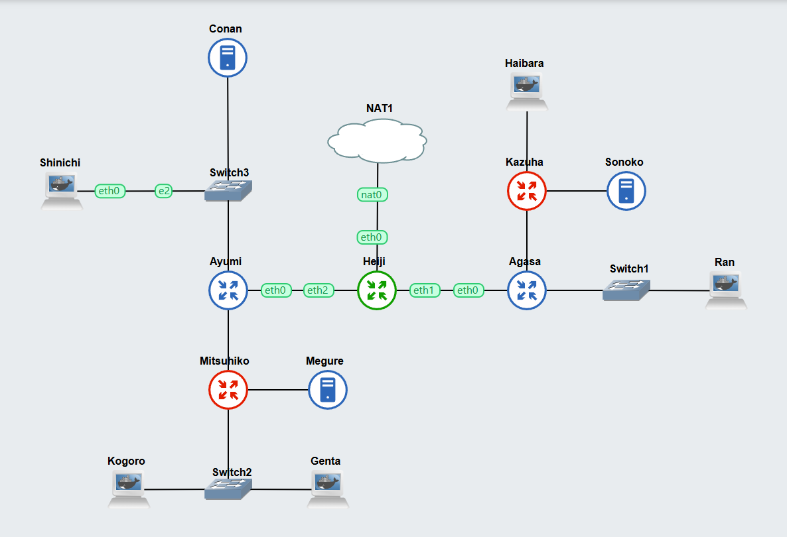
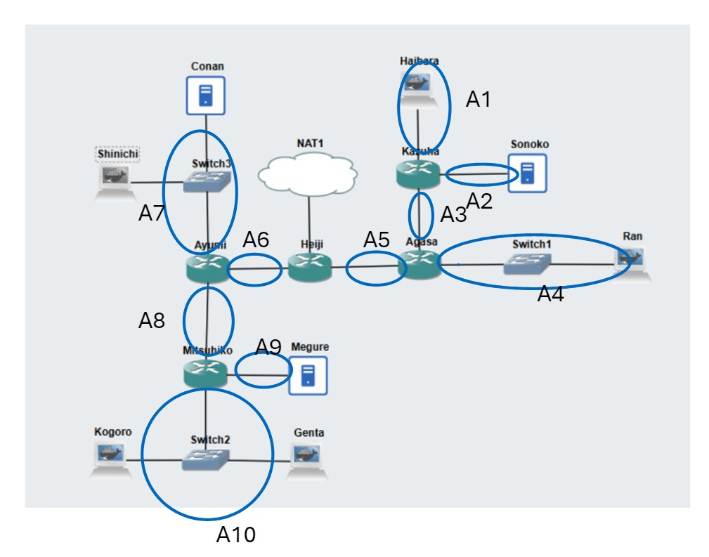

## Put your VLSM calculation here!

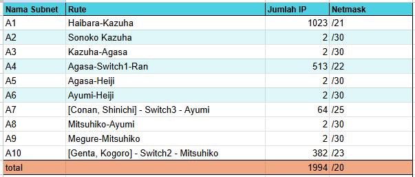

<b>Tree:</b>

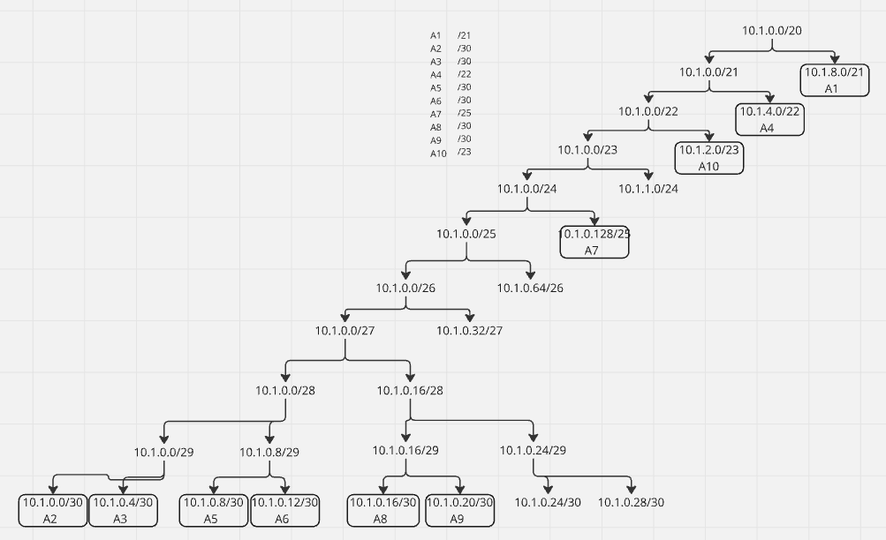

## Put your IP route here!


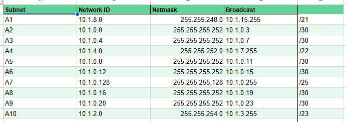


## Soal 1

> Bagaimana cara mengkonfigurasi iptables pada router bernama 'Heiji' agar memungkinkan jaringan mengakses internet melalui interface eth0 menggunakan SNAT tanpa menggunakan MASQUERADE?

> _How to configure iptables on a router named ‘Heiji’ to allow the network to access the internet through interface eth0 using SNAT without using MASQUERADE?_

**Answer:**

- Screenshot

    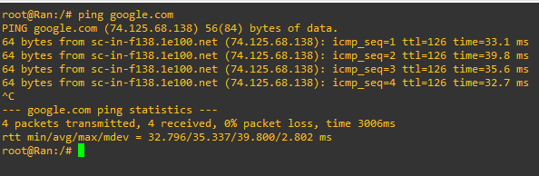

- Configuration

    ```sh
    iptables -t nat -A POSTROUTING -o eth0 -s 10.1.0.0/20 -j SNAT --to-source $(ip -4 addr show eth0 | grep -oP '(?<=inet\s)\d+(\.\d+){3}')
    ```

- Explanation

    Kita dapat menambahkan rule `iptables` pada table `nat` POSTROUTING dengan mengarahkan paket yang menuju interface `eth0` kepada target `SNAT` dengan menspesifikan IP address router Heiji yang mengarah pada cloud. Hal ini didapatkan dengan menggunakan command `grep` dengan regex untuk mendapatkan IP dari output command `ip addr`

<br>

## Soal 2

> Kalian diminta untuk melakukan drop semua paket masuk TCP kecuali pada port 1744 pada node Shinichi.

> _You are asked to drop all incoming TCP packets except on port 1744 on Shinichi's node_

**Answer:**

- Screenshot

    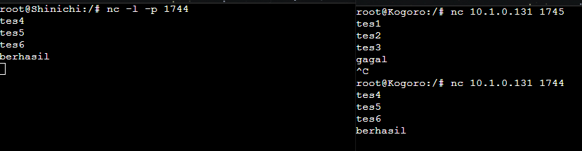

- Configuration

    Untuk melakukan filtering ''tcp'' pada node shinichi, dengan pengecualian di port 1744, dapat menggunakan perintah tersebut

    ```sh
    iptables -A INPUT -p tcp --dport 1744 -j ACCEPT
    iptables -A INPUT -p tcp -j DROP
    ```

- Explanation

    - ``-A INPUT``: Menambahkan aturan ke chain INPUT (rantai yang digunakan untuk lalu lintas yang menuju ke sistem).
    - ``-p tcp``: Menentukan protokol yang digunakan, dalam hal ini TCP. --dport 1744: Menentukan port tujuan, dalam hal ini port 1744.
    - ``-j ACCEPT``: Menentukan tindakan yang diambil jika paket memenuhi kriteria aturan, dalam hal ini menerima paket.
    - ``-j DROP``: Menentukan tindakan yang diambil jika paket memenuhi kriteria aturan, dalam hal ini menolak (DROP) paket.


<br>

## Soal 3

> Lakukan pembatasan sehingga koneksi SSH pada semua Web Server hanya dapat dilakukan oleh user yang berada pada node Ran.

> _Make restrictions so that SSH connections to all Web Servers can only be made by users who are on the Ran node._

**Answer:**

- Screenshot

    - <b>Berhasil</b>
    
        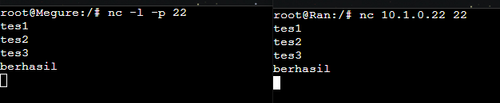
        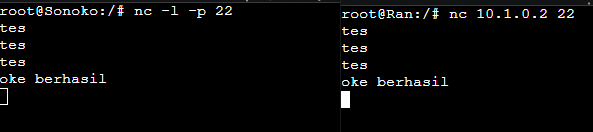
        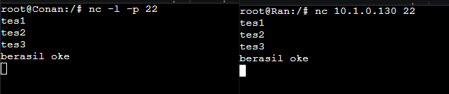
    
    - <b>Gagal</b>
    
        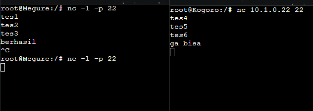
        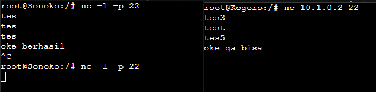
        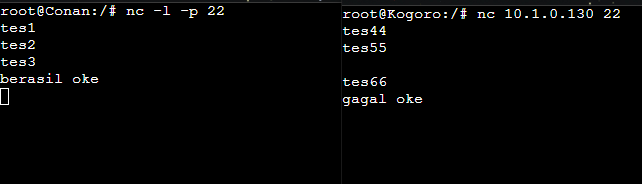

- Configuration

    Untuk melakukan pembatasan koneksi SSH pada webserver (Conan, Megure, dan Sonoko), maka perlu dibataskan untuk akses melalui port 22 saja. Ip address yang dapat mengaksesnya pun hanya ip dari node Ran

    ```sh
    iptables -A INPUT -p tcp --dport 22 -s 10.1.4.2 -j ACCEPT
    iptables -A INPUT -p tcp --dport 22 -j DROP
    ```

- Explanation

    - ``-A INPUT``: Menambahkan aturan ke chain INPUT (rantai yang digunakan untuk lalu lintas yang menuju ke sistem).
    - ``-p tcp``: Menentukan protokol yang digunakan, dalam hal ini TCP.
    - ``--dport 22``: Menentukan port tujuan, dalam hal ini port 22 (umumnya digunakan untuk layanan SSH).
    - ``-s 10.1.4.2``: Menentukan alamat sumber yang diizinkan. Dalam hal ini, hanya lalu lintas yang berasal dari alamat IP Ran dimana memiliki ip 10.1.4.2 yang diizinkan masuk
    - ``-j ACCEPT``: Menentukan tindakan yang diambil jika paket memenuhi kriteria aturan, dalam hal ini menerima paket.
    - ``-j DROP``: Menentukan tindakan yang diambil jika paket memenuhi kriteria aturan, dalam hal ini menolak (DROP) paket.


<br>

## Soal 4

> Semua subnet hanya dapat mengakses Web Server pada port 80 dan 443 (Conan, Sonoko, dan Megure) pada hari Senin-Jumat, pukul 07:00- 19:00.

> _All subnets can access the Web Server (Conan, Sonoko, and Megure) only on ports 80 and 443, from Monday to Friday, between 07:00-19:00._

**Answer:**

- Screenshot
    - Kasus tidak berhasil di luar waktu yang ditentukan (waktu dalam UTC)
    
    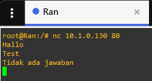 
    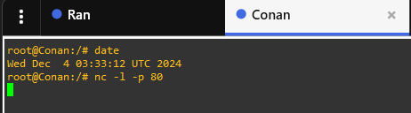

- Configuration
    ```sh
    iptables -A INPUT -p tcp -m multiport --dports 80,443 \
    -m time --timestart 07:00 --timestop 19:00 \
    --weekdays Mon,Tue,Wed,Thu,Fri -j ACCEPT
    iptables -A INPUT -p tcp -m multiport --dports 80,443 -j DROP
    ```
- Explanation

    Kita menggunakan `-m` untuk mengakses modul `time` untuk memerikan rules waktu dengan ```--timestart``` dan ```--timestop``` dalam UTC serta ```--weekdays``` untuk memberikan rules hari dalam iptables agar paket yang masuk pada waktu tersebut dapat diterima pada port 80 dan 443 pada webserver. Tambahkan juga rule `iptables` baru setelah rule sebelumnya untuk melakukan blokir pada semua paket yang masuk pada port 80 dan 443 pada webserver.


<br>

## Soal 5

> Ternyata subnet Haibara memiliki akses tambahan, yaitu dapat mengakses Web Server pada port 80 dan 443 di luar hari Senin-Jumat (hari Sabtu dan Minggu), tanpa pembatasan waktu.

> _The Haibara subnet has additional access, allowing it to access the Web Server on ports 80 and 443 outside of Monday to Friday (on Saturday and Sunday), with no time restrictions._

**Answer:**

- Screenshot

    `Put your screenshot in here`

- Configuration

    ```sh
    iptables -A INPUT -s 10.1.8.0/21 -p tcp -m multiport --dports 80,443 \
    -m time --weekdays Sat,Sun -j ACCEPT
    ```
- Explanation

    Seperti pada soal sebelumnya, perbedaannya adalah kita menggunakan opsi `-s` untuk memberikan detail agar paket yang berasal dari subnet Haibara (`10.1.8.0/21`) dapat diterima pada hari sabtu dan minggu. 

<br>

## Soal 6

> Akses ke Web Server Conan, Sonoko, dan Megure pada port 80 dan 443 dilarang pada hari Jumat, pukul 11:00-13:00 (maklum, Jumatan rek).

> _Access to the Web Server (Conan, Sonoko, and Megure) on ports 80 and 443 is prohibited on Fridays between 11:00-13:00 (It's Friday prayer time)._

**Answer:**

- Screenshot

    `Put your screenshot in here`

- Configuration

    ```sh
    iptables -A INPUT -p tcp -m multiport --dports 80,443 -m time --weekdays Fri --timestart 11:00 --timestop 13:00 -j DROP
    ```

- Explanation

    Pada soal kali ini, diperlukan sebuah aturan khusus di hari Jumat pada jam 11.00-13.00

    - ``--timestart 11:00``: Menentukan waktu mulai, dalam hal ini pukul 11:00.
    - ``--timestop 13:00``: Menentukan waktu berakhir, dalam hal ini pukul 13:00.
    - ``--weekdays Fri``: Menentukan hari di mana aturan ini berlaku, dalam hal ini Jumat.


<br>

## Soal 7

> Tambahkan logging paket yang di-drop di setiap node server dan router.

> _Enable logging for dropped packets on every server node and router._

**Answer:**

- Screenshot

    `Put your screenshot in here`

- Configuration

    `Put your configuration in here`

- Explanation

    `Put your explanation in here`


<br>

## Soal 8

> Untuk keperluan maintenance, pilih salah satu Subnet dan lakukan blokir terhadap semua request protokol ICMP (ping) dari luar subnet terhadap subnet tersebut.

> _For maintenance purposes, select one Subnet and block all ICMP (ping) protocol requests from outside the subnet to that subnet._

**Answer:**

- Screenshot

    `Put your screenshot in here`

- Configuration

    `Put your configuration in here`

- Explanation

    `Put your explanation in here`


<br>

## Soal 9

> Untuk meningkatkan keamanan, setiap Web Server harus bisa melakukan blok terhadap IP yang melakukan scanning port dalam jumlah yang tidak wajar (maksimal 10 scan port) di dalam selang waktu 1 menit. 

> _To enhance security, each Web Server must be able to block IP addresses that perform an excessive number of port scans (a maximum of 10 port scans) within a 1-minute interval._

**Answer:**

- Screenshot

    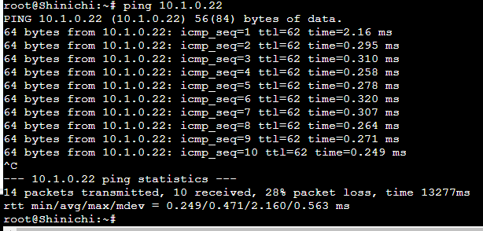
    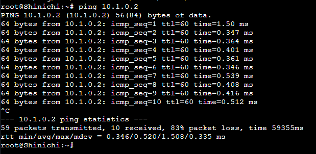
    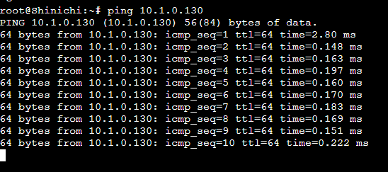

- Configuration

    ```sh
    iptables -N portscan

    iptables -A INPUT -m recent --name portscan --update --seconds 60 --hitcount 10 -j DROP
    iptables -A FORWARD -m recent --name portscan --update --seconds 60 --hitcount 10 -j DROP

    iptables -A INPUT -m recent --name portscan --set -j ACCEPT
    iptables -A FORWARD -m recent --name portscan --set -j ACCEPT
    ```

- Explanation

    Pada soal no 9 diperlukan rantai khusus bernama ``portscan`` yang digunakan untuk scanning port. 

    - ``iptables -N portscan``: Ini membuat rantai khusus bernama portscan. Rantai ini nantinya dapat digunakan untuk mengelola aturan-aturan terkait dengan deteksi port scanning.
    - ``-m recent --name portscan``: Menggunakan modul recent untuk melacak koneksi atau paket.
    - ``--update``: Mengupdate informasi tentang paket terkini.
    - ``--seconds 60``: Menetapkan waktu dalam detik, dalam hal ini 60 detik (1 menit).
    - ``--hitcount 10``: Menetapkan jumlah hit (pembaruan) yang diperlukan untuk memicu aksi selanjutnya.
    - ``-j DROP``: Menentukan tindakan yang diambil jika kriteria aturan terpenuhi, dalam hal ini menolak (DROP) paket.

Jadi, aturan ini akan menolak paket INPUT jika lebih dari 10 pembaruan terjadi dalam jangka waktu 1 menit, yang dapat dianggap sebagai tanda serangan port scanning.


<br>

## Soal 10

> Akses dari client ke WebServer Conan pada port 80 akan didistribusikan bergantian antara Web Server Conan dan Web Server Sonoko. Sebaliknya akses pada Web Server Sonoko pada port 443 akan didistribusikan bergantian antara Web Server Conan dan Web Server Sonoko. Lakukan evaluasi menggunakan Jmeter terhadap berbagai metode load balancing seperti Round-Robin dan lain-lainnya.

> _Client access to the Conan Web Server on port 80 should be alternated between the Conan Web Server and the Sonoko Web Server. Conversely, access to the Sonoko Web Server on port 443 should be alternated between the Conan Web Server and the Sonoko Web Server. (Evaluate various load balancing methods, such as Round-Robin and others, using JMeter.)_

**Answer:**

- Screenshot

    `Put your screenshot in here`

- Configuration

    `Put your configuration in here`

- Explanation

    `Put your explanation in here`


<br>
  
## Problems

## Revisions (if any)
